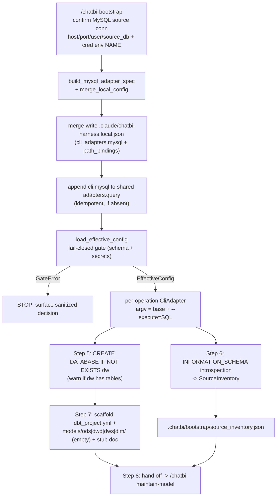

# Technical Design: `/chatbi-bootstrap` (MySQL-only v1)

> Status: AS_BUILT (2026-07-27). The design below was implemented and verified
> against live MySQL; see §10 "As-built reconciliation" for the delta between
> this design and the shipped code. The "what" (per-file change list) lives in
> `docs/modification-bootstrap.md`; the as-built call chain lives in
> `docs/feature-flow-bootstrap-v1.md` (AS_BUILT) and the design-vs-as-built
> evaluation in `docs/optimization-checklist-bootstrap-v1.md` (CONVERGED).
> Grounded in `.scratch/chatbi-bootstrap-plan.md` (approved). References to
> existing code cite the as-built harness source under `harness/`.
>
> Skill note: `~/.codex/superpowers/skills/writing-plans/SKILL.md` and
> `~/.agents/skills/grill-with-docs/SKILL.md` were both loaded. The
> writing-plans skill targets bite-sized TDD implementation plans (a downstream
> artifact); this doc is an upstream technical-design doc whose section
> structure is fixed by the orchestrator. The skill's quality bar (exact paths,
> complete content, no placeholders, self-review) is applied throughout. The
> grill skill's challenge-the-plan methodology is applied as a non-interactive
> self-audit; findings appear in §6 (open risks) since this legacy-flow step is
> non-conversational.

## 1. Goal + trust boundary

### 1.1 Goal

Close the harness "from-zero" gap: a governed command that scaffolds a local
Warehouse - shared/local config + `dw` database + dbt-mysql project structure +
source schema inventory - so the agent can then build ODS/DWD/DWS via
`/chatbi-maintain-model`. **MySQL-only v1.** dbt-mysql scaffold layout
(`models/{ods,dwd,dws,dim}/` + `dbt_project.yml`).

### 1.2 Trust boundary (verbatim from plan §"Key design decision")

> **bootstrap = INFRA SETUP only.** It does NOT create governed models, NOT
> approve metrics, NOT touch production, NOT run destructive migrations. Model
> creation stays in `/chatbi-maintain-model` (impact + sync + review +
> approval). bootstrap is to `/chatbi-maintain-model` what `install.sh` is to
> the harness: setup, not governed-artifact creation.

**bootstrap MAY:**
- write `.claude/chatbi-harness.local.json` (`cli_adapters.mysql` + optional
  `path_bindings`);
- append one `cli:mysql` entry to shared `adapters.query` (idempotent, if
  absent);
- `CREATE DATABASE IF NOT EXISTS dw` (non-destructive);
- introspect the source `public` schema via INFORMATION_SCHEMA;
- scaffold project dirs + stub companion doc;
- write `.chatbi/bootstrap/source_inventory.json`.

**bootstrap MUST NOT:** create ODS/DWD/DWS model files with governed content,
approve metrics, publish, or run destructive migration (SEM-003). ODS model
creation is handed off to `/chatbi-maintain-model`.

### 1.3 46-rule count unchanged

bootstrap cites 8 existing rules (§6) and adds none. The
`validate_domain_contract` gate (`gates.py:170-233`) continues to pass because
the contract artifacts (`CLAUDE.md`, `CONTEXT.md`, the three rule files, the
domain model) are not modified.

### 1.4 Flow



## 2. Gap resolution - option (a): per-operation `CliAdapter` with `--execute=<SQL>`

### 2.1 The gap

`CliAdapter._run` (`adapters/__init__.py:372-420`) sends a JSON operation
payload on stdin (`{"operation": "query", "compiled": {...}}`, `:375-380`) and
parses stdout as JSON (`:422-432`). The real `mysql` CLI expects SQL via `-e` /
`--execute` (or SQL on stdin) and emits tabular text, not JSON. There is a
protocol mismatch between CliAdapter's JSON-stdin contract and mysql's
SQL-`--execute` interface. This affects bootstrap Steps 5 and 6.

### 2.2 The resolution (decision 介入点①, option a)

bootstrap does NOT add a new adapter, NOT a shim script, NOT a JSON-protocol
wrapper. Instead, for each SQL operation the runbook constructs a per-operation
`CliAdapter` whose argv embeds `--execute=<SQL>`:

1. **Base argv** comes from the configured `cli_adapters.mysql.argv` (written by
   `build_mysql_adapter_spec` into local config, e.g.
   `["mysql", "--host", "127.0.0.1", "--port", "3306", "--user", "root",
   "--database=public"]`).
2. **Per operation**, bootstrap appends one element:
   `--execute=<SQL>` where `<SQL>` is a single statement.
3. bootstrap calls `adapters.resolve_executable(operation_argv[0], cli_allowlist)`
   (`adapters/__init__.py:109-143`) to resolve `mysql` to an allowlisted absolute
   path, and `adapters.build_cli_env(credential_env_names)` (`:146-162`) to build
   the whitelisted env (locale + safe PATH + declared credential env var NAMES,
   values sourced from the process env - no leaks).
4. bootstrap constructs `CliAdapter(adapter_id="cli:mysql", kind="query",
   argv=operation_argv, executable=..., cwd=workspace_root, env=...,
   credential_env_names=...)`. The constructor **re-runs**
   `validate_cli_argv(operation_argv)` (`adapters/__init__.py:352-354`), so the
   `--execute=<SQL>` element is re-validated at construction time.
5. The runbook invokes one of the adapter's public methods (e.g. `healthcheck`
   for DDL, `query` for the INFORMATION_SCHEMA SELECT). mysql ignores stdin when
   `--execute` is set; `CliAdapter._run` still sends its JSON/b'' stdin payload
   (`:374-381`), which mysql discards harmlessly. stdout is captured; for DDL it
   is empty, for SELECT it is tabular text. `_parse_stdout` (`:422-432`) wraps it
   as `{"untrusted": True, "stdout_raw": <text>, "returncode": N}` (JSON parse
   falls back to raw text). The runbook reads `stdout_raw` as **untrusted text**
   and never splices it into a prompt (the `untrusted: True` tag is already
   enforced by `_parse_stdout`).

### 2.3 Constraints (verified against code)

| Constraint | Rationale | Code reference |
| --- | --- | --- |
| **Single statement per `--execute`.** mysql runs one statement; no statement separator. | Avoids multi-statement injection surface. | mysql `--execute` semantics. |
| **No trailing `;`.** | `;` IS in `_SHELL_METACHARACTERS` and is rejected by `validate_cli_argv`. | `adapters/__init__.py:63` (`frozenset("\|;&\`$<>\\\n\r")`), `:104-105`. |
| **No shell metacharacters** anywhere in the SQL: `\| & ; \` $ < > \ \n \r`. | `validate_cli_argv` rejects any element containing one of these. | `adapters/__init__.py:63, 104-105`. |
| **No backtick-quoted identifiers, no `$`-variables, no `\` escapes** in INFORMATION_SCHEMA queries. | Backtick/`$`/`\` are metacharacters (rejected). Use regular identifiers and single-quoted string literals only. | `adapters/__init__.py:63`. |
| **`--execute` is permitted** (not a sensitive flag). | `_SECRET_ARGV` matches only `--?(api[-_]?key\|token\|password\|secret)...`; `--execute` does not match. | `adapters/__init__.py:55-58`; `config._SECRET_ARG` `config.py:30-33`. |
| **Single quotes are permitted** in the SQL (e.g. `WHERE TABLE_SCHEMA='public'`). | `'` is NOT in `_SHELL_METACHARACTERS`. | `adapters/__init__.py:63`. |
| **Spaces are permitted** in the `--execute=<SQL>` element. | `validate_cli_argv` rejects only metacharacters, not whitespace. (The schema's `\S` pattern applies only to the STORED config argv, not the runtime argv.) | `adapters/__init__.py:99-105`; schema `chatbi-harness.schema.json:171`. |

### 2.4 Runtime argv vs configured argv (clarification)

The `--execute=<SQL>` element is a **runtime-constructed** argv element, NOT a
stored config element. The configured `cli_adapters.mysql.argv` (validated by
the schema's `\S` + `minItems: 1` on read via `load_effective_config`) contains
only the base connection argv (no `--execute`). The runtime `--execute` element
is validated by `validate_cli_argv` inside the `CliAdapter` constructor
(`adapters/__init__.py:352-354`), NOT by the schema. This is consistent with how
`select_adapter` already re-runs `validate_cli_argv` on the configured argv at
selection time (`:596-614`): validation happens both at config-load (schema) and
at adapter-construction (`validate_cli_argv`).

### 2.5 Why not option (b)

Option (b) - a thin JSON-protocol shim script on the allowlist - was rejected:
it adds a new artifact to ship, a new allowlist entry to govern, and a new
attack surface (a script that wraps mysql). Option (a) reuses the existing
`CliAdapter` + `validate_cli_argv` + `resolve_executable` + `build_cli_env`
unchanged, adding zero new code paths to the adapter layer. The only cost is the
`stdout_raw` text-parsing in the runbook, which is acceptable because
`_parse_stdout` already tags it `untrusted: True`.

## 3. Lib API contract - `harness/.claude/lib/chatbi_harness/bootstrap.py`

`bootstrap.py` is a small deterministic module. It imports from `.config`
(`GateError` re-exported via `config._config_gate_error` pattern) and `.gates`
only. It does NOT import `adapters` (adapter construction is a runbook concern,
not a lib concern). It does NOT duplicate secret/argv validation - it delegates
to `load_effective_config` (which runs `_contains_secret_argv` +
`_contains_matching_string` + schema) and to the `CliAdapter` constructor.

### 3.1 `build_mysql_adapter_spec`

```python
def build_mysql_adapter_spec(
    host: str,
    port: int,
    user: str,
    *,
    database: str,
    credential_env_name: str | None = None,
) -> dict:
    """Build the cli_adapters.mysql spec (argv + credential_env_names).

    Returns {"argv": [...], "credential_env_names": [...]}. Never includes a
    password value. Raises GateError on violation.
    """
```

**Returns** (example, host=`127.0.0.1`, port=`3306`, user=`root`,
database=`public`, credential_env_name=`MYSQL_PWD`):

```json
{
  "argv": ["mysql", "--host", "127.0.0.1", "--port", "3306", "--user", "root", "--database=public"],
  "credential_env_names": ["MYSQL_PWD"]
}
```

With `credential_env_name=None` (local no-password root), the returned
`credential_env_names` is `[]` (the schema allows empty; `minItems` is not set
on `credential_env_names`, `chatbi-harness.schema.json:173-180`).

**Validation (raise `GateError` on violation):**
- `host`: non-empty `str`. Empty/non-str -> `GateError` (rule_ids
  `("HOOK-004",)`, evidence_ref `bootstrap:mysql-spec:host`).
- `port`: `int` (not `bool`), `1 <= port <= 65535`. Out of range / wrong type ->
  `GateError` (`HOOK-004`).
- `user`: non-empty `str`. Empty/non-str -> `GateError` (`HOOK-004`).
- `database`: non-empty `str`. Empty/non-str -> `GateError` (`HOOK-004`).
- `credential_env_name`: if not `None`, must match `^[A-Z_][A-Z0-9_]*$` (same
  regex as `adapters._CREDENTIAL_NAME` `adapters/__init__.py:86` and the schema
  `chatbi-harness.schema.json:178`). Mismatch -> `GateError` (rule_ids
  `("SEC-003", "HOOK-004")`, evidence_ref `bootstrap:mysql-spec:credential-name`).

**Invariants:**
- The returned dict contains ONLY `argv` and `credential_env_names` (the two
  keys the schema permits for a `cli_adapters.<name>` entry,
  `chatbi-harness.schema.json:166-183`).
- `argv[0]` is the bare name `"mysql"` (resolved to an allowlisted absolute path
  later by `resolve_executable` in the runbook).
- `--database=<database>` uses the `=`-combined form so the database name is a
  single argv element (matches the feature-flow §3 example).
- No password VALUE ever appears in `argv` or anywhere in the returned dict
  (SEC-003). `credential_env_names` carries only the env var NAME.

**Error style:** mirrors `config._config_gate_error` (`config.py:60-74`) - builds
a `GateDecision.block(...)` and wraps it in `GateError`. Sanitized by
`GateDecision.__post_init__` (`gates.py:62-72`).

### 3.2 `merge_local_config`

```python
def merge_local_config(
    existing: dict,
    *,
    path_bindings: dict | None = None,
    cli_adapters: dict | None = None,
) -> dict:
    """Merge path_bindings / cli_adapters into existing local config.

    Preserves existing keys; only adds/overwrites the supplied entries. Returns
    a new dict (does not mutate `existing`). Output is limited to path_bindings
    + cli_adapters top-level keys.
    """
```

**Semantics:**
- Start from a shallow copy of `existing` (or `{}` if `existing` is `None`).
- If `path_bindings` is supplied: merge into `result["path_bindings"]`
  (preserve existing bindings, add/overwrite the supplied ones).
- If `cli_adapters` is supplied: merge into `result["cli_adapters"]` (preserve
  existing adapters, add/overwrite the supplied ones - e.g. `mysql`).
- The result contains ONLY `path_bindings` and/or `cli_adapters` (the two keys
  `load_effective_config` permits in local config, `config.py:410-417`). Any
  other top-level key in `existing` is dropped (local config may not override
  shared/protected policy - SEM-003/HOOK-004).
- Returns a plain `dict` ready to be `json.dumps`-ed to
  `.claude/chatbi-harness.local.json`.

**Non-clobber guarantee:** an existing adapter `semantic` or an existing binding
`billing_app_root` not present in the supplied dicts is preserved verbatim.

### 3.3 `SourceInventory`

```python
@dataclass(frozen=True, slots=True)
class SourceColumn:
    name: str
    data_type: str
    is_primary_key: bool

@dataclass(frozen=True, slots=True)
class SourceTable:
    name: str
    columns: tuple[SourceColumn, ...]

@dataclass(frozen=True, slots=True)
class SourceInventory:
    source_database: str
    tables: tuple[SourceTable, ...]

    def to_dict(self) -> dict: ...
```

**Captures** the four aspects required by the plan: tables (`SourceTable.name`),
columns (`SourceColumn.name`), PKs (`SourceColumn.is_primary_key`), types
(`SourceColumn.data_type`).

**`to_dict()` shape** (written to `.chatbi/bootstrap/source_inventory.json`,
the hand-off contract surface to `/chatbi-maintain-model`, feature-flow §9):

```json
{
  "schema_version": 1,
  "source_database": "public",
  "tables": [
    {
      "name": "orders",
      "columns": [
        {"name": "id", "data_type": "bigint", "is_primary_key": true},
        {"name": "amount", "data_type": "decimal(18,2)", "is_primary_key": false}
      ]
    }
  ]
}
```

**Pattern conformance:** mirrors `CapabilitySnapshot` / `DiagnosticResult`
(frozen slots dataclass + `to_dict`, `diagnostics.py:44-88`, `312-382`). The
`schema_version: 1` field makes the shape self-describing for forward
compatibility (maintain-model can detect version drift without re-introspecting
the source DB, feature-flow §9 "stable and self-describing").

`SourceColumn` / `SourceTable` are internal helpers; only `SourceInventory` is
exported via `__init__.py`.

## 4. Skill procedure - `harness/.claude/skills/chatbi-bootstrap/SKILL.md`

The runbook mirrors `chatbi-maintenance/SKILL.md`'s shape (frontmatter
`name` + `description`, numbered procedure sections, footer). It carries
reusable procedure, not easily-stale facts. The 8 steps:

### Step 1 - Confirm MySQL source connection + credential handling
- Validate `host` non-empty, `port` int 1-65535, `user` non-empty, `source_db`
  non-empty. (Delegates to `build_mysql_adapter_spec`'s validation; mirrors
  `diagnostics._validate_configuration_path` validation style,
  `diagnostics.py:250-309`.)
- Credential: password -> env var NAME (e.g. `MYSQL_PWD`); local no-password
  root -> `credential_env_name=None` (empty `credential_env_names`). Never a
  value (SEC-003).
- Pure validation gate; writes nothing.

### Step 2 - Build + merge-write `.claude/chatbi-harness.local.json`
- `spec = build_mysql_adapter_spec(host, port, user, database=source_db,
  credential_env_name=...)`.
- `merged = merge_local_config(existing_local, cli_adapters={"mysql": spec},
  path_bindings={...} or None)`.
- Write `merged` to `.claude/chatbi-harness.local.json` (Workspace-relative;
  UTF-8 JSON, no duplicate keys, deterministic separators matching
  `EffectiveConfig.to_json` `config.py:375-382`).
- Merge semantics: preserve existing `path_bindings` / `cli_adapters`; only
  add/overwrite `cli_adapters.mysql` + the supplied path_binding. No clobber.

### Step 3 - Register `cli:mysql` in shared `adapters.query` (if absent)
- Read `.claude/chatbi-harness.json`; if `"cli:mysql"` not in
  `adapters.query`, append it (idempotent). Write back preserving UTF-8 + no
  duplicate keys + deterministic separators.
- This is the ONE shared-config write. Do NOT touch `adapters.semantic`,
  `governance`, `evaluation`, `runtime`, `workspace`, or `business_codebases`
  (governed, out of scope).

### Step 4 - Validate via `load_effective_config` (fail-closed)
- `config = chatbi_harness.load_effective_config(shared_path, local_path)`
  (`config.py:385-430`).
- This re-runs every gate: schema (`_validate_effective_data` `:266-350`),
  protected-actions (`:278-287`, SEM-003), sandbox fail-closed (`:288-294`,
  SEC-001), fixture-mode isolation (`:309-322`, PORT-001), path_ref/binding
  uniqueness + absoluteness (`:324-350`, SCOPE-001/PORT-001), secret-value +
  secret-argv scans (`:402-426`, SEC-003).
- On `GateError` (`gates.py:143-150`): surface the sanitized `GateDecision`
  (`gates.py:52-140`) and STOP. Do NOT retry with a "fixed" value.
- On success: use the immutable `EffectiveConfig` for all subsequent reads.

### Step 5 - Create target `dw` database (option a)
- Read base argv + `credential_env_names` from `config["cli_adapters"]["mysql"]`.
- Obtain the user-confirmed absolute `mysql` executable path (mirror
  `/chatbi-init`'s `claude_executable` confirmation, `chatbi-init.md:38-42`).
  Pass it as a single-element `cli_allowlist`.
- Pre-check: query `INFORMATION_SCHEMA.TABLES WHERE TABLE_SCHEMA='dw'` via a
  per-operation CliAdapter with `--execute=SELECT COUNT(*) FROM
  INFORMATION_SCHEMA.TABLES WHERE TABLE_SCHEMA='dw'`. If count > 0, emit a WARN
  (do not clobber, do not block).
- `operation_argv = base_argv + ["--execute=CREATE DATABASE IF NOT EXISTS dw"]`.
- `executable = resolve_executable(operation_argv[0], cli_allowlist)`
  (`adapters/__init__.py:109-143`); `env = build_cli_env(credential_env_names)`
  (`:146-162`); construct `CliAdapter(adapter_id="cli:mysql", kind="query",
  argv=operation_argv, executable=executable, cwd=workspace_root, env=env,
  credential_env_names=credential_env_names)`. The constructor re-runs
  `validate_cli_argv` (`:352-354`).
- Invoke the adapter (e.g. `healthcheck()`). Inspect the returned
  `AdapterEvidence`: `status == "ok"` and `returncode == 0` -> success;
  `error_category == "nonzero_exit"` -> STOP (PORT-001, surface the recovery
  action).

### Step 6 - Introspect source `public` schema (option a)
- Same per-operation CliAdapter construction as Step 5, but with
  `--execute=SELECT TABLE_NAME, COLUMN_NAME, DATA_TYPE, COLUMN_KEY FROM
  INFORMATION_SCHEMA.COLUMNS WHERE TABLE_SCHEMA='public' ORDER BY TABLE_NAME,
  ORDINAL_POSITION` (single-quoted string literal, no backticks, no `;`).
- Parse `stdout_raw` (untrusted text) into a `SourceInventory`. Populate
  `SourceTable` / `SourceColumn` (PK = `COLUMN_KEY == 'PRI'`).
- Write `SourceInventory.to_dict()` to `.chatbi/bootstrap/source_inventory.json`
  (under `runtime.evidence_root` = `.chatbi`, `chatbi-harness.schema.json:147-153`).
  Create the `bootstrap/` subdirectory if absent.
- The inventory is derived evidence about the source DB, NOT a governed model.

### Step 7 - Scaffold project dirs + stub companion doc
- dbt-mysql layout (plan §"Open question", default):
  `dbt_project.yml` + `models/{ods,dwd,dws,dim}/` (created EMPTY - bootstrap
  does not generate ODS DDL, out of scope §7).
- Stub `docs/org/data-warehouse-blueprint.md` if absent (structure/headers only;
  bootstrap does not author governed knowledge - DOC-001).
- Candidate writes require `workspace.allow_candidate_writes == true`
  (`chatbi-harness.schema.json:38`). Do not write outside the Workspace
  (SCOPE-001).

### Step 8 - Hand off
- Report: source table count, `dw` status (created / already-exists-with-tables
  warn), local + shared config paths written, scaffold paths, inventory file
  path.
- Next step: invoke `/chatbi-maintain-model` per ODS model (governed).
  `source_inventory.json` is the input. bootstrap does NOT call
  `/chatbi-maintain-model` itself; it reports the hand-off and stops.
- Footer: distinguish observation from interpretation; no secrets / absolute
  paths / PII in the report (SEC-003).

## 5. Test plan - `tests/harness/test_bootstrap.py`

`unittest` module. Mirrors `tests/harness/test_diagnostics.py` helpers:
`working_directory` (`:26-33`), `install_domain_contract` (`:36-47`), and the
`WORKSPACE_ROOT` / `HARNESS_LIB` / `sys.path.insert` bootstrap block (`:15-17`).
A `write_ready_config`-style helper (`:50-79`) provides a schema-valid shared
config so `load_effective_config` can round-trip the spec. **NO live MySQL** in
unit tests (no DB in CI).

### 5.1 `build_mysql_adapter_spec` cases

| Case | Assert |
| --- | --- |
| Correct argv + env name | `spec["argv"] == ["mysql","--host",h,"--port",str(p),"--user",u,"--database="+d]` and `spec["credential_env_names"] == ["MYSQL_PWD"]`. |
| `credential_env_name=None` | `spec["credential_env_names"] == []`. |
| No password value anywhere | `json.dumps(spec)` contains no value matching `_SECRET_VALUE` (`config.py:26-29`); no argv element matches `_SECRET_ARG` (`config.py:30-33`). |
| Empty host / user / database | raises `GateError` with `rule_ids` containing `HOOK-004`. |
| Port < 1 / > 65535 / non-int / bool | raises `GateError` (`HOOK-004`). |
| Bad `credential_env_name` (e.g. `"mysql_pwd"`, `"MYSQL-PWD"`, `"1PWD"`) | raises `GateError` with `rule_ids` containing `SEC-003` (must match `^[A-Z_][A-Z0-9_]*$`). |

### 5.2 `merge_local_config` cases

| Case | Assert |
| --- | --- |
| Preserve existing | existing `{"path_bindings": {"a": "/x"}, "cli_adapters": {"semantic": {...}}}` + `cli_adapters={"mysql": spec}` -> result keeps `a` and `semantic`, adds `mysql`. |
| Add new | empty existing + `path_bindings={"r": "/y"}` + `cli_adapters={"mysql": spec}` -> result has both. |
| No clobber of unrelated | existing `mysql` spec is overwritten only when `cli_adapters={"mysql": new_spec}` is supplied; other adapters untouched. |
| Drops non-local keys | existing with a smuggled `governance` key -> result has only `path_bindings` / `cli_adapters`. |
| No mutation of `existing` | after the call, the input dict is unchanged. |

### 5.3 Spec round-trips through `load_effective_config`

- Install domain contract in a temp Workspace; write a ready shared config
  (mirror `write_ready_config`, `test_diagnostics.py:50-79`) with
  `adapters.query=[]`; write local config from `build_mysql_adapter_spec(...)` +
  `merge_local_config(...)`.
- `load_effective_config(shared, local)` returns an `EffectiveConfig` with
  `config["cli_adapters"]["mysql"]["argv"]` present and the spec's
  `credential_env_names`.
- Assert no `GateError`.

### 5.4 Secret / password rejection -> `GateError`

- A local config whose `cli_adapters.mysql.argv` contains `--password=secret`
  -> `load_effective_config` raises `GateError` with `rule_ids` containing
  `SEC-003` (via `_contains_secret_argv`, `config.py:174-186`). Assert the
  `GateError` is raised and `decision.status == "block"`.
- A local config containing a `password=sk-...` value -> `GateError` (via
  `_contains_matching_string` + `_SECRET_VALUE`, `config.py:26-29,402-426`).

### 5.5 `SourceInventory` shape

- Construct a `SourceInventory` with two tables, call `to_dict()`, assert the
  `schema_version == 1`, `source_database`, and the nested `tables[].columns[]`
  with `name` / `data_type` / `is_primary_key`. Assert the dict is JSON-serializable
  (`json.dumps` with `allow_nan=False` succeeds).

### 5.6 What is NOT tested (out of scope)

- Live MySQL connection / actual `CREATE DATABASE` / actual INFORMATION_SCHEMA
  query (no DB in CI; covered by runbook + manual E2E).
- `select_adapter` / `resolve_executable` / `build_cli_env` end-to-end (already
  covered by `tests/harness/test_adapters.py` - 183 tests; bootstrap does not
  duplicate them).
- `validate_domain_contract` / `load_effective_config` internals (already
  covered by `tests/harness/test_contract.py` / `test_config.py`).

## 6. Open risks (grill self-audit, non-blocking)

These are surfaced by challenging the plan against the as-built code. None
blocks the design; each is a flag for the implementer.

1. **`cli_allowlist` is not a config field.** `select_adapter` /
   `resolve_executable` take `cli_allowlist` as a caller parameter
   (`adapters/__init__.py:501,615`), defaulting to `()`. The schema has no
   `cli_allowlist` field, so an empty allowlist means `resolve_executable` never
   matches -> STOP fail-closed. bootstrap is the first command to drive a cli
   adapter end-to-end. **Resolution:** the SKILL obtains the user-confirmed
   absolute `mysql` realpath (mirror `/chatbi-init`'s `claude_executable`
   confirmation, `chatbi-init.md:38-42`, `installation.md:50-54`) and passes it
   as a single-element allowlist. This keeps the security boundary explicit and
   human-confirmed (SEC-001/PORT-001/HOOK-004), consistent with the existing
   harness pattern. The implementer MUST make this explicit in the SKILL; it is
   not a lib concern (`build_mysql_adapter_spec` does not take an allowlist).

2. **`CliAdapter._run` JSON-stdin is semantically wasted under option (a).**
   When `--execute` is set, mysql ignores stdin; `CliAdapter._run` still sends
   its JSON/b'' payload (`adapters/__init__.py:374-381`), which mysql discards.
   stdout is raw text, wrapped by `_parse_stdout` as
   `{"untrusted": True, "stdout_raw": ...}` (`:422-432`). This works but is
   semantically awkward (calling `healthcheck()`/`query()` to run arbitrary SQL).
   **Mitigation:** the SKILL documents that `stdout_raw` is the source of truth
   and is untrusted (never spliced into a prompt - already enforced by the
   `untrusted: True` tag). No adapter-layer change is required for v1; a future
   `--execute`-aware adapter method could remove the awkwardness (out of scope).

3. **Shared-config append has no lib helper.** `merge_local_config` covers the
   LOCAL layer only. The shared `adapters.query` idempotent append (Step 3) is
   performed by the SKILL. The writer must preserve UTF-8 + no duplicate keys +
   deterministic separators (the reader `_load_json` enforces these on read,
   `config.py:86-144`). **Recommendation:** reuse
   `json.dumps(..., ensure_ascii=False, sort_keys=True, allow_nan=False,
   separators=(",", ":"))` to match `EffectiveConfig.to_json` (`config.py:375-382`).
   If the implementer prefers, a small `merge_shared_query_adapters` helper could
   be added to `bootstrap.py`, but the plan does not require it.

4. **`dw` exists-with-tables detection is an extra query.** Step 5's "warn if
   `dw` has tables" requires a pre-check INFORMATION_SCHEMA query before
   `CREATE DATABASE IF NOT EXISTS dw`. This is one extra `--execute` round-trip.
   Not a blocker; the SKILL documents it as Step 5a.

5. **StarRocks / MySQL-protocol engines.** The plan notes StarRocks is
   MySQL-protocol-compatible so `cli:mysql` "largely works". This is unverified
   for v1 (MySQL-only). The SKILL states MySQL-only; non-MySQL engines are out
   of scope (§7).

## 7. Rules cited (NO new rule; 46 stays 46)

| Rule | Where bootstrap touches it |
| --- | --- |
| SCOPE-001 | One Workspace; candidate writes limited to it (Steps 2, 5, 7). Local config + scaffold + inventory stay inside the Workspace. |
| SCOPE-002 | If a Business Codebase path_binding is supplied, it must use the configured read-only alias; bootstrap never executes/edits the external root. |
| SEC-001 | Sandbox must fail-closed (`config.py:288-294`); bootstrap does not elevate access and requests minimum authorization for the mysql CLI (allowlist-confirmed executable). |
| SEC-003 | No credentials/PII/absolute paths in output; password = env var NAME, never value. Enforced by `_contains_secret_argv` + `_SECRET_VALUE` + schema `^[A-Z_][A-Z0-9_]*$`. |
| PORT-001 | `cli:mysql` must resolve to the allowlist; no fixture as production fallback; portable references in any report. |
| SEM-003 | bootstrap does NOT create governed models or approve metrics; protected actions stay with the human owner. This is the boundary that keeps bootstrap out of `/chatbi-maintain-model` territory. |
| DOC-001 | bootstrap stubs the companion doc but does not author governed knowledge; governed references stay co-located with models and routed through `/chatbi-maintain-knowledge`. |
| HOOK-004 | Deterministic fail-closed gates; `load_effective_config` schema validation is the gate. bootstrap does not bypass it. |

The `validate_domain_contract` gate (`gates.py:170-233`) continues to pass: the
contract artifacts are not modified, and no rule is added/renamed/reworded.

## 8. Out of scope (v1)

- **Bulk ODS DDL generation.** bootstrap produces inventory only; ODS model
  creation is governed via `/chatbi-maintain-model`. Future: a `--generate-ods`
  flag.
- **Non-MySQL engines.** StarRocks is MySQL-protocol-compatible so `cli:mysql`
  largely works unmodified; Hive and other engines need their own adapter
  (future).
- **Live MySQL unit tests.** No MySQL server in CI; the runbook + manual E2E
  cover the live path. Unit tests cover the deterministic lib surface
  (`build_mysql_adapter_spec`, `merge_local_config`, `SourceInventory`) only.
- **Live/deterministic hook registration.** bootstrap is invoked via
  SessionStart-only command routing; it does not register new PreToolUse /
  PostToolUse hooks (HOOK-001/003/004 unchanged).
- **A `--execute`-aware adapter method.** Option (a) reuses the existing
  `CliAdapter` public methods (`healthcheck`/`query`) with `--execute` in argv.
  A dedicated method is a future refinement (§6 risk 2).

## 9. Verification (for the implementer, not this design step)

- `python3 -B -m unittest discover -s tests/harness` (expect 533+N green, where
  N = the new `test_bootstrap.py` cases).
- `./build-product.sh` (clean build; `chatbi-bootstrap` command present;
  `chatbi_harness.bootstrap` in the import canary; canary sweep clean).
- Manual smoke: temp Workspace, `/chatbi-bootstrap` against
  127.0.0.1:3306/`public` -> local config written + `dw` created +
  `source_inventory.json` produced + dbt-mysql scaffold present.

## 10. As-built reconciliation (2026-07-27)

This design was implemented as the 7th harness command (`/chatbi-bootstrap`,
MySQL-only v1) and the flow was verified against a live MySQL server. The
design content in §§1-9 is preserved as the design record; this section
records the deltas between design and shipped code, and the verification
evidence. Authoritative as-built references:

- `docs/feature-flow-bootstrap-v1.md` (AS_BUILT) - real line-cited call chain
- `docs/optimization-checklist-bootstrap-v1.md` (CONVERGED) - design-vs-as-built
  evaluation across 8 axes, 0 BLOCKER / 0 MAJOR
- `harness/.claude/lib/chatbi_harness/bootstrap.py` - shipped lib surface
- `harness/.claude/commands/chatbi-bootstrap.md` +
  `harness/.claude/skills/chatbi-bootstrap/SKILL.md` - command + 9-step runbook
- `tests/harness/test_bootstrap.py` - 30 deterministic cases

### 10.1 Design refinements during implementation

| # | Design (this doc) | As-built | Rationale |
| --- | --- | --- | --- |
| 1 | §4 specifies an 8-step procedure | SKILL ships a 9-step procedure | Security-prominence: the SKILL elevated the `mysql` executable path + `cli_allowlist` confirmation (design §4 Step 5 sub-item, §6 risk #1) into its own Step 2, mirroring `/chatbi-init`'s `claude_executable` confirmation. Substance unchanged; only step grouping changed. |
| 2 | §6 risk #3 recommended `sort_keys=True, separators=(",",":")` for the shared-config append | SKILL uses `indent=2, sort_keys=False` | Matches the existing human-edited `.claude/chatbi-harness.json` file style (minimal diff, preserves readability). Consistent with §4 Step 3's "matching the existing file style" guidance. |
| 3 | §3.2 `merge_local_config(existing: dict, ...)` | Widened to `existing: dict \| None` | Allows callers to pass `None` for "no existing local config" without an extra `{}` at the call site. Improvement, not regression; the "or `{}` if `existing` is `None`" semantics were already in the design. |

### 10.2 Documentation nits fixed (from optimization-checklist v1)

All 3 findings in `docs/optimization-checklist-bootstrap-v1.md` §9 were applied
as one-word / one-line edits (no code or behavior change):

- **MINOR-1** - `harness/.claude/commands/chatbi-bootstrap.md` step-count
  reference corrected from "8-step" to "9-step".
- **NIT-1** - `docs/feature-flow-bootstrap-v1.md` step-count sentence updated
  to note the SKILL refined the design's 8 steps into 9 (by splitting
  `cli_allowlist` confirmation into Step 2).
- **NIT-2** - `harness/.claude/skills/chatbi-bootstrap/SKILL.md` Step 7
  INFORMATION_SCHEMA query changed `TABLE_SCHEMA='public'` to
  `TABLE_SCHEMA='<source_db>'` (placeholder for the agent to substitute the
  actual source DB name confirmed in Step 1).

### 10.3 Gap resolution verified

§2's option (a) - per-operation `CliAdapter` with `--execute=<SQL>` - was
verified end-to-end against live MySQL (§10.4). No adapter-layer change was
required; `CliAdapter._run`'s JSON-stdin payload is harmlessly discarded by
mysql when `--execute` is set, and `_parse_stdout` tags `stdout_raw` as
`untrusted: True` as designed. Option (b) (a JSON-protocol shim script) was
not pursued, as predicted.

### 10.4 Live smoke evidence (test-agent, 2026-07-27)

Against the user's local MySQL `127.0.0.1:3306`, root, no password:

- `CREATE DATABASE IF NOT EXISTS dw` succeeded (non-destructive; risk #4
  pre-check `SELECT COUNT(*) FROM INFORMATION_SCHEMA.TABLES WHERE
  TABLE_SCHEMA='dw'` returned 0 tables).
- Source `public` schema introspected: **125 tables** captured into
  `.chatbi/bootstrap/source_inventory.json`.
- mysql CLI = `/opt/homebrew/bin/mysql` 9.7.1 (allowlist-confirmed per SKILL
  Step 2, mirroring `/chatbi-init`).
- mysql 9.7.1 confirmed protocol-compatible with the option-(a)
  `--execute=<SQL>` approach.

This is the first harness command to drive a `cli:` adapter end-to-end
against a real engine; the live smoke confirms the §2 gap resolution and that
all 5 §6 open risks are handled (cli_allowlist confirmation, stdout_raw
untrusted, shared-config append discipline, dw pre-check warn, StarRocks
unverified v1).

### 10.5 Test + build evidence

- `python3 -B -m unittest discover -s tests/harness`: **563 passed** (533
  baseline + 30 new in `test_bootstrap.py`), 1 skipped (OS sandbox BLOCKING
  GAP, pre-existing). Domain-contract gate passes.
- `./build-product.sh`: clean build. Import OK, canary clean, no dev-only
  leak, `chatbi-bootstrap` command present in `../chatbi`,
  `chatbi_harness.bootstrap` in the import canary.

### 10.6 Rules unchanged

46-rule count unchanged (8 cited by bootstrap: SCOPE-001, SCOPE-002, SEC-001,
SEC-003, PORT-001, SEM-003, DOC-001, HOOK-004). No rule added, renamed, or
reworded; `validate_domain_contract` continues to pass. See §7 for the
citation table and `docs/optimization-checklist-bootstrap-v1.md` §5 for the
verification.

### 10.7 Out-of-scope v1 (unchanged from §8)

Bulk ODS DDL generation, non-MySQL engines, live MySQL unit tests, and
live/deterministic hook registration remain out of scope for v1, as in §8.

STATUS: AS_BUILT
