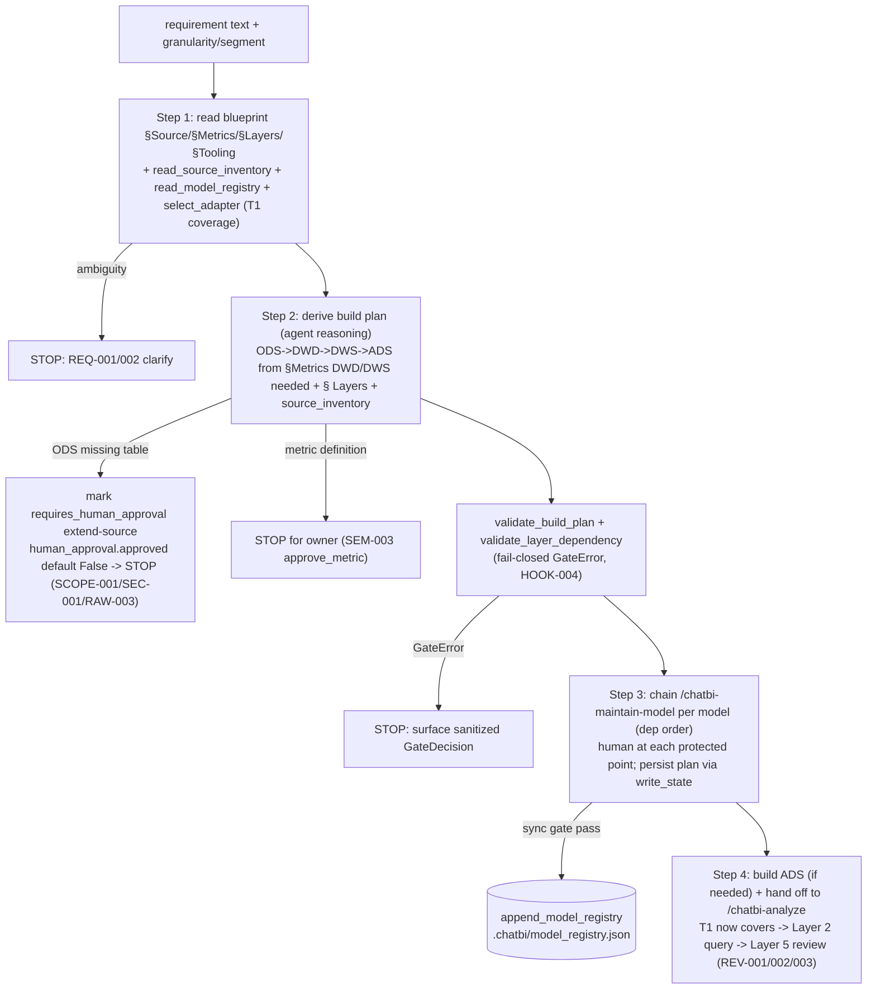

# Technical Design: `/chatbi-build-from-requirement` (requirement-driven build)

> Status: AS_BUILT (legacy step 10, 2026-07-29). This doc describes **how** the 8th command and
> its supporting thin lib / bootstrap / maintain-model / product-doc changes are
> implemented - API contracts, dataclass fields, function signatures, schema
> shape, test plan. The design contracts in §§2-3 were verified against the final
> code at step 10; all match as written (no contract weakened). Four
> implementation enhancements (MINOR, defensive / sanctioned v1) are recorded in
> §12 as as-built deviations, not back-merged into §§2-3. The **what** (per-module change list) lives in
> `docs/modification-requirement-driven-build.md` (STATUS: DRAFTED); the scanned
> capability map in `docs/feature-flow-requirement-driven-build-v1.md`
> (STATUS: SCANNED); the 6 adopted design decisions (Q1-Q6) in
> `docs/orchestrator-state.md:8-14`. References to existing code cite the
> as-built harness source under `harness/` and were verified against it.
>
> Skill note: `~/.codex/superpowers/skills/writing-plans/SKILL.md` was loaded.
> That skill targets bite-sized TDD implementation plans (a downstream artifact);
> this is an upstream technical-design doc whose section structure is fixed by
> the orchestrator. The skill's quality bar (exact paths, complete content, no
> placeholders, type consistency, self-review) is applied throughout. Its
> header/task/checkbox format is NOT used here - this is a design contract, not
> an exec plan.

## 1. Goal + trust boundary

### 1.1 Goal

Close the `/chatbi-analyze` "needs new model" gap. analyze only queries
(T1->T2->T3 degrade) and STOPs when T1 coverage cannot be determined
(`chatbi-analyze.md:198-199`, within the Stop-conditions block `:192-205`).
The new command derives a DWD/DWS/ADS build plan from a requirement + DW state
+ blueprint, chains `/chatbi-maintain-model` per model in dependency order,
routes protected points to the human, and hands off to `/chatbi-analyze` once
models are in place so analyze no longer STOPs.

### 1.2 Trust boundary (orchestrator trust layer)

The new command is an **orchestrator**, the same "narrow trust layer" shape as
`/chatbi-bootstrap` (`chatbi-bootstrap.md:13-33`, INFRA SETUP only).

**It MAY:**
- read blueprint (`docs/org/data-warehouse-blueprint.md` § Source / § Metrics /
  § Layers / § Tooling), `.chatbi/bootstrap/source_inventory.json`,
  `.chatbi/model_registry.json`, and the semantic layer via `select_adapter`
  (`adapters/__init__.py`);
- call `/chatbi-maintain-model` per plan entry in dependency order;
- persist the build plan via `harness_state.write_state`
  (`harness_state.py:100-123`) to `.chatbi/runs/<sid>/build_plan.json`;
- append a built model to `.chatbi/model_registry.json` (Module 4) only after a
  maintain-model sync gate + stop_gate pass.

**It MUST NOT:** author governed model content (maintain-model does), answer the
business question (analyze does), approve a canonical metric / change access
policy / publish / run destructive migration (SEM-003, the human does), self-
certify (META-008), or extend the source boundary without human approval
(SCOPE-001/SEC-001/RAW-003). No machine absolute paths / secrets / PII
(SEC-003/PORT-001).

**No derivation lib.** join/aggregate logic is agent reasoning in SKILL Step 2
(`orchestrator-state.md:31-33`); the lib only reads + validates plan shape.

### 1.3 46-rule count unchanged

The command cites existing rules only (§7). No rule is added/renamed/reworded;
`validate_domain_contract` (`gates.py:170-233`) continues to pass because the
contract artifacts (`CLAUDE.md`, `CONTEXT.md`, the three rule files, the domain
model) are not modified. Cross-layer is declarative blueprint knowledge in
`## Layers`, not a governed rule ID (META-003/PORT-001).

### 1.4 Flow



## 2. Lib API contract - `harness/.claude/lib/chatbi_harness/build_plan.py`

A thin deterministic module over existing `bootstrap`/`gates`/`evidence`/
`harness_state` primitives. Mirrors `bootstrap.py` discipline
(`bootstrap.py:1-22`): does NOT duplicate secret/path validation (delegates to
`load_effective_config`); raises `GateError` (HOOK-004) on validation violation,
mirroring `_bootstrap_gate_error` (`bootstrap.py:44-64`) and
`_impact_gate_error` (`impact.py:45-56`). **Does NOT derive** join/aggregate
logic; only reads + validates plan shape + appends registry evidence.

### 2.1 Imports + module posture

```python
from __future__ import annotations
import json, os
from dataclasses import dataclass
from pathlib import Path
from typing import Any, Mapping

from .gates import GateDecision, GateError, _sanitize_text  # sanctioned reuse (impact.py:24, evidence.py:34)
from .bootstrap import SourceInventory, read_source_inventory, merge_source_inventories  # Q4: reader+merge live in bootstrap.py
from .evidence import _get_schema, _validate_against_schema  # sanctioned reuse (impact.py:25-29)
```

- `_sanitize_text` is **defined** at `gates.py:39-45` (redacts URL queries,
  named secrets, bearer tokens, sk-/pk- prefixes, POSIX/Windows absolute paths).
  It is imported into `impact.py:24` and `evidence.py:34`; `build_plan.py`
  follows the same sanctioned-private-import pattern (Q5).
- Schema validation reuses `evidence._get_schema` (`evidence.py:462-474`) +
  `_validate_against_schema` (`evidence.py:477-490`), exactly as
  `impact.validate_impact_manifest` does (`impact.py:233-239`). The supported
  keyword subset (`evidence.py:396-397`) constrains `build-plan.schema.json` to:
  `type, enum, pattern, minimum, minItems, uniqueItems, items, properties,
  propertyNames, required, additionalProperties` (no `oneOf`/`anyOf`/`const`).
  Note `_matches_type` (`evidence.py:374-385`) accepts a list for `type`, so
  `"type": ["object","null"]` is supported; when value is `null`, the
  `additionalProperties:false` check is skipped (`evidence.py:430-431`).
- No new third-party deps. No import of `adapters` (adapter construction is a
  runbook concern, same as `bootstrap.py:4-7`).

### 2.1.1 `__init__.py` re-exports (MODIFY `harness/.claude/lib/chatbi_harness/__init__.py`)

Q4 changes where two names live vs the modification doc (which pre-dated Q4).
The existing bootstrap import block (`__init__.py:3-7`) is EXTENDED to also
import the two new bootstrap-side names; a NEW build_plan import block is added.
`__all__` (`__init__.py:19-36`, alphabetic-ish: classes then functions) gains
the new names. Concretely:

```python
from .bootstrap import (
    SourceInventory,
    build_mysql_adapter_spec,
    merge_local_config,
    read_source_inventory,        # NEW (Q4): lives in bootstrap.py
    merge_source_inventories,     # NEW (Q4): lives in bootstrap.py
)
# ... existing config/diagnostics/gates/paths imports ...
from .build_plan import (        # NEW block
    BuildPlan,
    LayerRule,
    ModelEntry,
    append_model_registry,
    read_model_registry,
    validate_build_plan,
    validate_layer_dependency,
)
```

- `read_source_inventory` and `merge_source_inventories` are exported from
  **bootstrap** (Q4), NOT from build_plan. `build_plan.py` imports them via
  `from .bootstrap import ...` (§2.1); `__init__.py` re-exports them from
  bootstrap so the SKILL can write `chatbi_harness.read_source_inventory`.
- `read_source_inventory` is intentionally NOT in the build_plan import block
  (it would shadow the bootstrap definition). The other seven build_plan names
  are exported from build_plan only.
- `HumanApproval` / `CrossLayerException` are internal helpers (like
  `SourceColumn`/`SourceTable`, `bootstrap.py:201,210`); NOT exported via
  `__init__.py` (only the top-level `BuildPlan`/`ModelEntry`/`LayerRule` +
  functions are public).

### 2.2 `ModelEntry` dataclass (frozen, slots)

Mirrors `SourceTable` / `SourceInventory` (`bootstrap.py:200-250`,
frozen-slots). The `name` field IS the logical-alias target (PORT-001); there is
no separate `target` field (in BuildPlan context the entry's target = the model
being built = `name`).

```python
_LAYERS = frozenset({"ods", "dwd", "dws", "ads", "dim"})
# _CHANGE_KINDS reused from impact.py:31-33 = {model,column,semantic,reference,
#   Skill,downstream,eval}. Re-import rather than re-declare: impact.py owns it.
from .impact import _CHANGE_KINDS
_PROTECTED_ACTIONS = frozenset({
    "approve_metric", "change_access_policy", "production_publish",
    "destructive_migration",
})  # mirrors impact.py:39-42 + chatbi-harness.schema.json:44-49
_ALIAS = re.compile(r"^[a-z][a-z0-9_-]{1,62}$")  # PORT-001; source: chatbi-harness.schema.json:36 (workspace.id)
_SCHEMA_VERSION = 1


@dataclass(frozen=True, slots=True)
class HumanApproval:
    """Extend-source human approval (Q1). Mirrors correction.owner_approved
    default-False (evaluator.py:222,253,226 'no auto-merge; SEM-003')."""
    approved: bool = False
    approver: str | None = None
    rule_ids: tuple[str, ...] = ()  # SCOPE-001/SEC-001/RAW-003 for extend-source

    def to_dict(self) -> dict[str, Any]:
        return {
            "approved": self.approved,
            "approver": self.approver,
            "rule_ids": list(self.rule_ids),
        }


@dataclass(frozen=True, slots=True)
class CrossLayerException:
    """Explicit cross-layer exception (Q2). Stays in plan metadata + registry;
    does NOT enter the blueprint (blueprint holds the declarative rule)."""
    reason: str
    approved_by: str

    def to_dict(self) -> dict[str, Any]:
        return {"reason": self.reason, "approved_by": self.approved_by}


@dataclass(frozen=True, slots=True)
class ModelEntry:
    name: str                              # logical alias (PORT-001); == target
    layer: str                             # ods|dwd|dws|ads|dim
    upstream_deps: tuple[str, ...]         # model names this depends on
    change_kind: str                       # impact.py:31-33 _CHANGE_KINDS
    created_rev: str
    owner: str
    cross_layer_exception: CrossLayerException | None = None  # Q2
    join_or_aggregate_summary: str = ""    # agent-derived; sanitized on persist (Q5)
    protected_action_flags: tuple[str, ...] = ()  # subset of _PROTECTED_ACTIONS (SEM-003)
    requires_human_approval: bool = False  # extend-source flag (not in enum)
    human_approval: HumanApproval = HumanApproval()  # Q1; default approved=False

    def to_dict(self) -> dict[str, Any]:
        cle = self.cross_layer_exception
        return {
            "name": self.name,
            "layer": self.layer,
            "upstream_deps": list(self.upstream_deps),
            "change_kind": self.change_kind,
            "created_rev": self.created_rev,
            "owner": self.owner,
            "cross_layer_exception": cle.to_dict() if cle is not None else None,
            "join_or_aggregate_summary": self.join_or_aggregate_summary,
            "protected_action_flags": list(self.protected_action_flags),
            "requires_human_approval": self.requires_human_approval,
            "human_approval": self.human_approval.to_dict(),
        }
```

**Construction validation** (a `build_model_entry(...)` factory, mirroring
`build_impact_manifest` `impact.py:138-230`): raises `GateError` (HOOK-004) when
- `name` does not match `_ALIAS` (PORT-001; same pattern source as
  `chatbi-harness.schema.json:36`);
- `layer` not in `_LAYERS`;
- `change_kind` not in `_CHANGE_KINDS` (`impact.py:31-33`);
- any `protected_action_flags` member not in `_PROTECTED_ACTIONS` (SEM-003);
- `cross_layer_exception` is not `None` and has an empty `reason` (Q2: an
  exception with no reason is not an exception).

The factory sanitizes the text fields (`name`, `owner`, `join_or_aggregate_summary`,
`human_approval.approver`, `cross_layer_exception.reason`/`approved_by`) via
`_sanitize_text` BEFORE constructing (Q5, SEC-003; same as
`impact.py:174`/`evaluator.py:243-250`). A field that sanitizes to empty where
non-empty is required (e.g. `name`) raises `GateError` (PORT-001/HOOK-004).

### 2.3 `LayerRule` dataclass (frozen, slots)

```python
@dataclass(frozen=True, slots=True)
class LayerRule:
    """One layer + the set of layers it may depend on (Q6b). Parsed from
    blueprint ## Layers by the AGENT and passed in; the lib does NOT parse
    markdown (META-003/PORT-001)."""
    layer: str
    may_depend_on: frozenset[str]
```

`layer_rules: tuple[LayerRule, ...]` is supplied by the SKILL (agent reads
`## Layers`, Q6b). v1 default (matching the bootstrap stub skeleton, Module 5):
`ods -> {}`, `dwd -> {ods, dim}`, `dws -> {dwd, dim}`, `ads -> {dws, dim}`,
`dim -> {}`. The lib treats `layer_rules` as opaque caller input (no markdown
parsing, per modification §10 open point 4).

### 2.4 `BuildPlan` dataclass (frozen, slots)

Mirrors `SourceInventory` (`bootstrap.py:217-250`): frozen-slots + `to_dict()`
that produces the shape validated by `build-plan.schema.json` and persisted to
`.chatbi/runs/<sid>/build_plan.json`.

```python
@dataclass(frozen=True, slots=True)
class BuildPlan:
    schema_version: int            # = 1
    session_id: str
    models: tuple[ModelEntry, ...] # ordered ODS->DWD->DWS->ADS; each carries human_approval (Q1)

    def to_dict(self) -> dict[str, Any]:
        # Persistence shape. Text fields are already sanitized at ModelEntry
        # construction (Q5); to_dict does not re-sanitize (mirrors ImpactManifest.to_dict, impact.py:93-104).
        return {
            "schema_version": self.schema_version,
            "session_id": self.session_id,
            "models": [m.to_dict() for m in self.models],
        }
```

**Persistence discipline (Q5):** the SKILL persists via
`harness_state.write_state(workspace_root, session_id, "build_plan.json",
plan.to_dict())` (`harness_state.py:100-123`). `write_state` does
`json.dumps(data, ensure_ascii=False, sort_keys=True)` + atomic temp+rename at
`0o600` (`harness_state.py:106-116`). Sanitization happens at ModelEntry
construction (before `to_dict`), so the persisted payload is already
sanitized - consistent with `ImpactManifest` (sanitized in `build_impact_manifest`
`impact.py:174,203`, then `to_dict` `impact.py:93-104` emits verbatim).

### 2.5 `read_model_registry(path) -> tuple[ModelEntry, ...]`

```python
def read_model_registry(path: Path) -> tuple[ModelEntry, ...]:
    """Read .chatbi/model_registry.json (derived evidence under runtime.
    evidence_root = .chatbi, chatbi-harness.schema.json:151). Returns () if the
    file is absent (first build) - absence is an empty registry, NOT an error
    (Q3: not fail-closed on absent). On present-but-malformed: raises GateError
    (HOOK-004). schema_version must be 1 (Q3, mirrors source_inventory)."""
```

- Absent file (`not path.is_file()`) -> return `()`.
- Present: `json.loads`; if `schema_version != 1` -> `GateError` (HOOK-004,
  evidence_ref `build-plan:registry:schema-version`).
- Each `models[i]` is re-validated through `build_model_entry(**entry)` (the
  same factory + `_sanitize_text`), so a tampered registry entry (bad alias,
  unknown layer/change_kind, unsanitizable text) raises `GateError` on read
  (fail-closed on tampered evidence; only absent is non-error).
- Q3: **no separate schema file** for the registry - `ModelEntry.to_dict()` is
  the shape, `read_model_registry` is the validator (mirrors `source_inventory`:
  `SourceInventory.to_dict()` writer `bootstrap.py:232-250` + this reader; no
  `source-inventory.schema.json` exists).

### 2.6 `read_source_inventory(path) -> SourceInventory` (lives in `bootstrap.py` - Q4)

**Placement decision (Q4, overrides modification §10 open point 1):** the reader
lives in `bootstrap.py` (the producer also reads - mirrors `impact.py`, which
has both `build_impact_manifest` `:138-230` and `validate_impact_manifest`
`:233-239`). `build_plan.py` imports it: `from .bootstrap import
read_source_inventory` (§2.1). `SourceInventory`/`SourceTable`/`SourceColumn`
are defined ONCE in `bootstrap.py:200-250` (no redefinition).

```python
# In bootstrap.py (added alongside to_dict at bootstrap.py:232-250):
def read_source_inventory(path: Path) -> SourceInventory:
    """Inverse of SourceInventory.to_dict() (bootstrap.py:232-250). Parse
    .chatbi/bootstrap/source_inventory.json into SourceInventory/SourceTable/
    SourceColumn. Absent file -> GateError (HOOK-004): the build-from-requirement
    flow requires a bootstrapped Workspace; an absent inventory is a missing
    prerequisite, not an empty registry. Malformed JSON / schema_version != 1 /
    unknown column shape -> GateError."""
```

Rationale for the absent-policy asymmetry vs `read_model_registry`: the registry
starts empty (first build legitimately has no models); the source inventory is a
bootstrap prerequisite - its absence means bootstrap has not run, which is a
hard STOP for build-from-requirement Step 1. Both are fail-closed on
malformed/tampered; they differ only on absent.

### 2.7 `validate_build_plan(plan, layer_rules, known_models) -> None`

Pure shape check (no reasoning). Raises `GateError` (HOOK-004) on:

1. **Topology order (Q6a) + SCOPE-001 cross-plan-boundary (open point 6
   decision, overrides v1 simplification):** each `upstream_dep` must either
   appear BEFORE its dependent in `plan.models` (intra-plan topology, including
   DIM referenced before the dependent) OR be in `known_models` (a pre-existing
   model in the registry). Concretely: build a name->index map; for each entry,
   every `upstream_dep` that is in the plan must have an index < the entry's
   index (a dep that appears later -> `GateError`, evidence_ref
   `build-plan:topology:<name>`, rule_ids `("DOC-002","HOOK-004")`). A dep that
   is neither in `plan.models` nor in `known_models` -> `GateError` (SCOPE-001,
   evidence_ref `build-plan:scope:<name>:<dep>`, rule_ids
   `("SCOPE-001","HOOK-004")`). The SKILL passes
   `known_models = {m.name for m in read_model_registry(...)}` (all known model
   names from the registry). This is a DAG-order check + boundary check,
   independent of layer names.
2. **Alias (PORT-001):** every `entry.name` matches `_ALIAS`
   (`^[a-z][a-z0-9_-]{1,62}$`, source `chatbi-harness.schema.json:36`). Already
   enforced at construction, but re-asserted here as the schema contract
   boundary.
3. **Protected-action consistency (SEM-003):** if
   `entry.protected_action_flags` is non-empty, then
   `entry.requires_human_approval` must be `True` (a declared protected action
   requires human approval). Mismatch -> `GateError` (SEM-003/HOOK-004). All
   flags must be in `_PROTECTED_ACTIONS` (already enforced at construction;
   re-asserted).
4. **Extend-source human approval (Q1):** if
   `entry.requires_human_approval is True` and
   `entry.human_approval.approved is not True` -> `GateError` (rule_ids
   `("SCOPE-001","SEC-001","RAW-003","HOOK-004")`, evidence_ref
   `build-plan:human-approval:<name>`). This is the extend-source gate: an
   unapproved extend-source entry cannot pass validation. Reuses the
   correction `owner_approved` default-False posture (`evaluator.py:222,226`).

```python
def validate_build_plan(
    plan: BuildPlan,
    layer_rules: tuple[LayerRule, ...],
    known_models: frozenset[str] = frozenset(),
) -> None:
    """Pure shape validation (HOOK-004 fail-closed). No derivation.

    known_models (open point 6 decision): the set of pre-existing model names
    from the registry. A dep in known_models is a pre-existing model (no
    ordering constraint, no SCOPE-001 violation). A dep in neither the plan nor
    known_models -> GateError (SCOPE-001 cross-plan-boundary).
    """
```

After the field checks, `validate_build_plan` calls
`_validate_against_schema(plan.to_dict(), _get_schema("build-plan.schema.json"),
"build-plan.schema.json")` so the schema file is the single contract (mirrors
`impact.py:229` calling `validate_impact_manifest`).

### 2.8 `validate_layer_dependency(plan, layer_rules) -> None`

Layer-permission matrix (Q6b), INDEPENDENT of `validate_build_plan`'s topology
check (Q6: two separate checks). Raises `GateError` (HOOK-004) when a model
depends on a layer not permitted by `layer_rules`.

```python
def validate_layer_dependency(plan: BuildPlan, layer_rules: tuple[LayerRule, ...]) -> None:
    """For each entry, every upstream_dep's layer must be in this entry's
    LayerRule.may_depend_on (Q6b). CrossLayerException present with non-empty
    reason -> does NOT raise (Q2)."""
```

- Build `layer_of: dict[str,str]` from `plan.models` (name->layer) + any
  pre-existing registry models the SKILL supplies (v1: plan-internal names only;
  a dep to a pre-existing model is resolved by the SKILL before calling, or
  passed via the same `known_models` arg noted in open point 6).
- For each entry: look up `LayerRule` for `entry.layer`; for each
  `upstream_dep`, resolve its layer; if that layer not in `may_depend_on`:
  - if `entry.cross_layer_exception is not None` and
    `entry.cross_layer_exception.reason` is non-empty -> do NOT raise (Q2: an
    explicit, documented exception is allowed; it stays in plan metadata +
    registry, not the blueprint).
  - else -> `GateError` (rule_ids `("DOC-002","HOOK-004")`, evidence_ref
    `build-plan:layer:<name>:<dep>`).
- v1 default matrix (matches the bootstrap `## Layers` stub skeleton, Module 5):
  `dwd` may depend on `{ods, dim}`; `dws` on `{dwd, dim}`; `ads` on
  `{dws, dim}`; `ods`/`dim` on `{}`. A plan where ADS reads DWD/ODS directly,
  DWS reads ODS directly, or DWD reads DWS (reverse) raises. A documented
  exception (e.g. an ADS that legitimately reads a DIM directly is already
  permitted since `dim` is in `ads`'s set; a true cross-layer skip needs the
  exception) does NOT raise.

### 2.9 `append_model_registry(path, entry) -> Path`

Appends one `ModelEntry` to `.chatbi/model_registry.json` (create if absent).
Called by maintain-model ONLY after sync gate + stop_gate pass (Module 4,
DOC-004/HOOK-001 - a failed-sync model is NOT recorded, fail-closed).

```python
def append_model_registry(path: Path, entry: ModelEntry) -> Path:
    """Atomic temp+rename mirroring harness_state.write_state discipline
    (harness_state.py:104-122, 0o600). Idempotent on (name, created_rev)
    (modification §10 open point 3: v1 = append-with-history; a rebuild at a
    new rev keeps both entries). Returns the registry path."""
```

- **Cannot reuse `harness_state.write_state` directly:** that function is
  path-constrained to `.chatbi/runs/<session_id>/<name>.json`
  (`harness_state.py:29,47-60`); the registry lives at
  `.chatbi/model_registry.json` (evidence_root direct child, not under
  `runs/`). So `append_model_registry` **mirrors the discipline inline** (read
  existing, mutate a copy, `json.dumps(..., ensure_ascii=False,
  sort_keys=True)`, `os.open(tmp, O_WRONLY|O_CREAT|O_TRUNC, 0o600)`,
  `os.replace(tmp, path)`), exactly as `write_state` does at
  `harness_state.py:106-116`.
- **Read existing:** absent file -> start `{"schema_version": 1, "models": []}`;
  present -> `json.loads`; `schema_version != 1` -> `GateError` (HOOK-004).
- **Idempotency:** if any existing entry has the same `(name, created_rev)`,
  return `path` unchanged (no duplicate, no rewrite). v1 keeps history: a
  rebuild at a new `created_rev` appends a second entry (open point 3).
- **Append:** `models.append(entry.to_dict())`; the entry is already sanitized
  at construction (Q5).
- **Atomic write:** temp file `path.with_suffix(path.suffix + ".tmp")`,
  `0o600`, `os.replace`. On exception, unlink the temp (mirror
  `harness_state.py:117-121`).
- **Does not mutate** the `entry` argument or the on-disk list in place; builds
  a new list, writes atomically.

### 2.10 `merge_source_inventories(base, extra) -> SourceInventory` (lives in `bootstrap.py`)

```python
# In bootstrap.py:
def merge_source_inventories(base: SourceInventory, extra: SourceInventory) -> SourceInventory:
    """Union tables by name. On name collision -> GateError (HOOK-004): do NOT
    silently overwrite an already-inventoried table (modification §10 open
    point 2: v1 = fail-closed; a future overwrite-with-human-approval path is
    out of scope). Returns a new frozen SourceInventory (does not mutate inputs).
    schema_version stays 1 (inventory shape unchanged, only adds tables)."""
```

- `base` = on-disk inventory (read via `read_source_inventory`); `extra` = the
  scoped incremental introspect result (newly-approved tables only).
- Collision (`extra` table name already in `base`) -> `GateError` (rule_ids
  `("HOOK-004",)`, evidence_ref `bootstrap:merge:collision:<name>`). v1 does not
  refresh columns of an existing table (open point 2).
- Result `source_database` = `base.source_database` (the incremental introspect
  is against the same source DB).
- Exported from `__init__.py` alongside `read_source_inventory` (Q4).

## 3. `build-plan.schema.json` shape

`harness/.claude/schemas/build-plan.schema.json`. Mirrors
`impact-manifest.schema.json:1-34` (draft-07 `$schema`, `$id`,
`x-implemented-keywords`, `additionalProperties: false`, `required` +
`properties` with enum/pattern). The `$schema` value is cosmetic - validation
uses the hand-rolled subset `evidence._validate_schema_subset`
(`evidence.py:388-456`); draft-07 is chosen to match the sibling
`impact-manifest.schema.json:2`.

```jsonc
{
  "$schema": "http://json-schema.org/draft-07/schema#",
  "$id": "build-plan.schema.json",
  "title": "ChatBI requirement-driven build plan",
  "description": "Ordered model build plan derived by /chatbi-build-from-requirement. Pure shape contract for validate_build_plan (HOOK-004). Applicable rules: SCOPE-001, SEC-001/003, RAW-003, SEM-003, PORT-001, DOC-002, META-003, HOOK-004.",
  "x-implemented-keywords": ["type", "enum", "pattern", "required", "properties", "items", "additionalProperties"],
  "type": "object",
  "additionalProperties": false,
  "required": ["schema_version", "session_id", "models"],
  "properties": {
    "schema_version": {"type": "integer", "enum": [1]},
    "session_id": {"type": "string"},
    "models": {
      "type": "array",
      "items": {
        "type": "object",
        "additionalProperties": false,
        "required": ["name", "layer", "upstream_deps", "change_kind", "created_rev", "owner", "cross_layer_exception", "join_or_aggregate_summary", "protected_action_flags", "requires_human_approval", "human_approval"],
        "properties": {
          "name": {"type": "string", "pattern": "^[a-z][a-z0-9_-]{1,62}$"},
          "layer": {"type": "string", "enum": ["ods", "dwd", "dws", "ads", "dim"]},
          "upstream_deps": {"type": "array", "items": {"type": "string"}},
          "change_kind": {"type": "string", "enum": ["model", "column", "semantic", "reference", "Skill", "downstream", "eval"]},
          "created_rev": {"type": "string"},
          "owner": {"type": "string"},
          "cross_layer_exception": {
            "type": ["object", "null"],
            "additionalProperties": false,
            "required": ["reason", "approved_by"],
            "properties": {"reason": {"type": "string"}, "approved_by": {"type": "string"}}
          },
          "join_or_aggregate_summary": {"type": "string"},
          "protected_action_flags": {"type": "array", "items": {"type": "string", "enum": ["approve_metric", "change_access_policy", "production_publish", "destructive_migration"]}},
          "requires_human_approval": {"type": "boolean"},
          "human_approval": {
            "type": "object",
            "additionalProperties": false,
            "required": ["approved", "approver", "rule_ids"],
            "properties": {
              "approved": {"type": "boolean"},
              "approver": {"type": ["string", "null"]},
              "rule_ids": {"type": "array", "items": {"type": "string"}}
            }
          }
        }
      }
    }
  }
}
```

Notes:
- `change_kind` enum reuses `impact.py:31-33` (`_CHANGE_KINDS`), same as
  `impact-manifest.schema.json:12`.
- `name` pattern = `chatbi-harness.schema.json:36` (`workspace.id`), the PORT-001
  alias source. `impact-manifest.schema.json:13` leaves `target` as a plain
  string (validated only in `build_impact_manifest` `impact.py:174`); build-plan
  enforces the pattern in BOTH the schema and `build_model_entry` (defense in
  depth, since plan entries are persisted + resumed).
- `cross_layer_exception` uses `"type": ["object","null"]` (supported by
  `_matches_type` list handling, `evidence.py:375-376`); when `null`, the
  `additionalProperties:false` check is skipped (`evidence.py:430-431`).
- `protected_action_flags` items enum = `chatbi-harness.schema.json:44-49`.
- The schema does NOT encode topology or layer-permission rules (those are
  `validate_build_plan`/`validate_layer_dependency` logic, Q6); it is the
  structural contract only, mirroring how `impact-manifest.schema.json` encodes
  structure while `ImpactManifest.has_blocking_drift` (`impact.py:106-119`)
  encodes logic.

## 4. bootstrap incremental introspect

### 4.1 `merge_source_inventories` + `read_source_inventory` placement

Both added to `bootstrap.py` (Q4). `read_source_inventory` is the inverse of
`SourceInventory.to_dict()` (`bootstrap.py:232-250`); `merge_source_inventories`
is the union helper. See §2.6 / §2.10 for contracts.

### 4.2 Incremental path (SKILL procedure, `chatbi-bootstrap/SKILL.md` Step 7)

The incremental mode is an **additional entry point** to Step 7
(`chatbi-bootstrap/SKILL.md:160-178`), triggered when
`/chatbi-build-from-requirement` flagged extend-source AND the human approved
the new source (SCOPE-001/SEC-001/RAW-003). It does NOT replace the full
one-shot introspect.

1. Read the existing inventory via `read_source_inventory(.chatbi/bootstrap/
   source_inventory.json)` (Q4).
2. Construct a per-operation `CliAdapter` (option a, `chatbi-bootstrap/SKILL.md`
   Step 6 pattern) with `--execute=SELECT TABLE_NAME, COLUMN_NAME, DATA_TYPE,
   COLUMN_KEY FROM INFORMATION_SCHEMA.COLUMNS WHERE TABLE_SCHEMA='<source_db>'
   AND TABLE_NAME IN ('t1','t2',...) ORDER BY TABLE_NAME, ORDINAL_POSITION` -
   **scoped to the approved table set only** (single-quoted literals, no
   backticks, no `;`, same constraints as `chatbi-bootstrap/SKILL.md:164-167`).
3. Parse `stdout_raw` (untrusted text, tagged by `_parse_stdout`) into a
   `SourceInventory` (the `extra` set).
4. `merged = merge_source_inventories(base, extra)` - collision raises
   `GateError` (v1 fail-closed, §2.10).
5. Rewrite `.chatbi/bootstrap/source_inventory.json` via
   `SourceInventory.to_dict()` + the same `json.dumps(..., indent=2,
   sort_keys=False)` writer (`chatbi-bootstrap/SKILL.md:175-176`).
6. `schema_version` stays `1` (`bootstrap.py:234`): the inventory shape is
   unchanged (tables/columns/PK/type); incremental only adds tables. No schema
   bump, no migration.

The full introspect path (Step 7 as-is) and its tests
(`tests/harness/test_bootstrap.py`) are NOT broken - the incremental mode is a
new sub-path, not a replacement. Same untrusted-`stdout_raw` discipline
(`chatbi-bootstrap/SKILL.md:168-171`).

## 5. maintain-model writes registry + reads § Layers

### 5.1 SKILL §3 read block extension (`chatbi-maintenance/SKILL.md:46-52`)

Extend the existing §3 Metrics read block (which already reads `## Metrics`
before drafting, `:46-52`) to ALSO read `## Layers` for the cross-layer
dependency rule. Same posture as § Metrics / §0 Tooling (`:12-24`): if `## Layers`
is absent or has no rule for the model's layer, ask the operator - do NOT invent
cross-layer rules (META-003: declarative knowledge lives in the blueprint, not
the SKILL; PORT-001). This is the declarative input `validate_layer_dependency`
(Q6b) consumes (the agent parses `## Layers` into `LayerRule` and passes it in).

### 5.2 Append `ModelEntry` after sync gate passes (`chatbi-maintenance/SKILL.md:54-60`)

New step after §4 sync gate (`:54-60`) passes + `stop_gate` passes: call
`chatbi_harness.build_plan.append_model_registry(
   Path(".chatbi/model_registry.json"), ModelEntry(...))` to record the built
model (name, layer, upstream_deps, change_kind, created_rev, owner, plus
cross_layer_exception if applicable). This is the contract surface the new
workflow's Step 1 reads (`read_model_registry`).

- **Derived evidence**, NOT governed config: does NOT enter
  `chatbi-harness.schema.json` (top-level `additionalProperties: false`
  `:186`; registry lives under `.chatbi/` = `runtime.evidence_root`
  `chatbi-harness.schema.json:151`).
- **Fail-closed:** the append happens ONLY after sync gate + stop_gate pass
  (DOC-004/HOOK-001). A model that failed sync is NOT recorded (the registry is
  a record of built models, not attempted ones).
- The SKILL change is **procedural** (documents the call order); the lib
  contract is `append_model_registry` (§2.9). The maintenance flow imports
  `build_plan` for the append - cross-module import is the norm
  (`impact.py:24-29` already imports from `gates`/`evidence`).

## 6. New command + SKILL structure

### 6.1 `harness/.claude/commands/chatbi-build-from-requirement.md` (ADD)

Mirror `chatbi-bootstrap.md` structure (verified line refs):
frontmatter `description` + `argument-hint` (`chatbi-bootstrap.md:1-4`) ->
`## 0. Trust boundary` (`:13`) -> `## 1. Bind to the runbook` (`:34`) ->
`## 2. Inputs` (`:40`) -> `## 3. Output evidence` (`:50`) -> `## 4. Stop
conditions` (`:58`) -> `## 5. Non-goals` (`:71`) -> `## Rules` (`:85`).

- **`description`:** orchestrator that derives a build plan from a requirement +
  DW state + blueprint, chains `/chatbi-maintain-model` in dependency order,
  routes protected points (source boundary / metric approval / access policy /
  production publish / destructive migration) to the human, and hands off to
  `/chatbi-analyze` once models exist. Does NOT write governed content, answer,
  or approve (SEM-003/META-008).
- **`argument-hint`:** `[requirement-text] [granularity] [segment]` (requirement
  is wider than analyze's 7-field request: "build the metric system that can
  answer X", not "answer X").
- **`## 0. Trust boundary`:** orchestrator = derive + chain + human-in-loop +
  handoff (§1.2). MAY read blueprint/source_inventory/model_registry/semantic
  layer; MAY call `/chatbi-maintain-model` per plan entry; MAY persist the build
  plan via `harness_state.write_state` (`harness_state.py:100-123`). MUST NOT
  author governed content / approve a metric / change access policy / publish /
  run destructive migration (SEM-003), answer (that is `/chatbi-analyze`),
  self-certify (META-008), or extend the source boundary without human approval
  (SCOPE-001/SEC-001/RAW-003). No machine absolute paths / secrets / PII
  (SEC-003/PORT-001).
- **`## 1. Bind to the runbook`:** load `skills/chatbi-build/SKILL.md`.
- **`## 2. Inputs`:** requirement text + optional granularity/dimension/segment;
  reads blueprint (`docs/org/data-warehouse-blueprint.md` § Source / § Metrics /
  § Layers / § Tooling), `.chatbi/bootstrap/source_inventory.json`,
  `.chatbi/model_registry.json`, semantic layer via `select_adapter`.
- **`## 3. Output evidence`:** build-plan summary (ordered model list with
  change_kind / name / upstream deps / join-or-aggregate summary / protected
  flags / requires_human_approval / human_approval), per-model maintain-model
  footer aggregation, final hand-off to `/chatbi-analyze`. Distinguish
  observation from interpretation (FBK-003).
- **`## 4. Stop conditions`:** requirement ambiguity (REQ-001/002); source-
  boundary extend (ODS missing table -> STOP for human, SCOPE-001/SEC-001);
  metric definition (SEM-003 `approve_metric`); `validate_build_plan` /
  `validate_layer_dependency` raise `GateError` (HOOK-004); any maintain-model
  sync gate fails (DOC-004). Surface sanitized `GateDecision`, do not retry with
  a "fixed" value.
- **`## 5. Non-goals`:** no governed model authoring (route via maintain-model);
  no answer (route via analyze); no build-plan independent review (REV-001 is the
  answer gate only); no derivation lib (join/aggregate logic is agent reasoning,
  not a deterministic lib); no new governed rule.
- **`## Rules`:** REQ-001/002/003/004, RAW-003, SEM-001/003, SCOPE-001,
  SEC-001/003, PORT-001, META-003/008, DOC-001/002/004, HOOK-004, REV-001,
  ANS-003, FBK-003. No new rule; 46 stays 46.

### 6.2 `harness/.claude/skills/chatbi-build/SKILL.md` (ADD)

Mirror `chatbi-bootstrap/SKILL.md` shape: frontmatter `name` + `description`
(`:1-4`), `## 0. Sources this runbook binds to` (`:15`), numbered procedure
sections, `## N. Applicable governing rules` (`:238`). The 4-step flow
(feature-flow §3) maps to SKILL steps:

- **`## 0. Sources`:** lib surface `chatbi_harness.build_plan` (BuildPlan,
  ModelEntry, LayerRule, read_model_registry, validate_build_plan,
  validate_layer_dependency, append_model_registry) + `chatbi_harness.bootstrap`
  (read_source_inventory, merge_source_inventories - Q4); reused primitives
  `load_effective_config` (`config.py`), `select_adapter` (`adapters/`),
  `policy.decide` (`policy.py`), `harness_state.write_state`/`read_state`
  (`harness_state.py:100,63`), `fail_closed`/`GateError` (`gates.py:143-167`);
  schema `build-plan.schema.json`. Trust boundary restated (orchestrator).
- **`## 1. Step 1 - Read requirement + DW state (pure read)`:** parse requirement
  (multi-sense terms explicit, REQ-002; multi-team definitions listed not merged,
  REQ-004); read blueprint § Source/§ Metrics/§ Layers/§ Tooling;
  `read_source_inventory` + `read_model_registry`; discover T1 coverage via
  `select_adapter`. STOP on ambiguity (REQ-001/002). Cites RAW-003, SEM-001,
  SCOPE-001, SEC-003, PORT-001, DOC-001.
- **`## 2. Step 2 - Derive build plan (agent reasoning)`:** reuse existing
  DWD/DWS if T1 covers; else derive ODS->DWD (join keys/grain) ->DWS (aggregate
  dims/measure formula) ->ADS from blueprint § Metrics `DWD needed`/`DWS needed`
  + § Layers cross-layer rules + source_inventory existence. ODS missing table ->
  mark `requires_human_approval=True` extend-source, STOP (SCOPE-001/SEC-001/
  RAW-003). Metric definitions -> STOP for owner (SEM-003). Call
  `validate_build_plan` + `validate_layer_dependency` (HOOK-004 fail-closed).
  Cites SEM-003, SCOPE-001/SEC-001, RAW-003, DOC-002, PORT-001, META-003.
  **Explicit:** derivation is agent reasoning; the lib only reads + validates
  plan shape (no derivation lib).
- **`## 3. Step 3 - Chain /chatbi-maintain-model per model (human at protected
  points)`:** for each plan entry in dependency order (ODS->DWD->DWS->ADS),
  invoke `/chatbi-maintain-model` with the derived join/aggregate summary as
  change-request input. Each call runs maintain-model's full flow (classify ->
  read § Tooling/§ Metrics/§ Layers [Module 5] -> `build_impact_manifest` ->
  candidates -> sync gate DOC-004 -> stop_gate -> footer). Human at each
  protected point (SEM-003: approve_metric / change_access_policy /
  production_publish / destructive_migration; SEC-001/ANS-003 high-risk).
  Routine build + join/aggregate derivation = agent (no per-model human sign-
  off). Persist plan + progress via `harness_state.write_state` to
  `.chatbi/runs/<sid>/build_plan.json` (resumable). On maintain-model success,
  `append_model_registry` (Module 4).
- **`## 4. Step 4 - Build ADS + hand off to /chatbi-analyze`:** if the
  requirement needs an ADS layer, chain one final `/chatbi-maintain-model` (ADS
  depends on DWS, cross-layer per § Layers). Once models exist, hand off to
  `/chatbi-analyze` - T1 now covers (new metric/dimension landed via
  maintain-model's semantic change_kind), so analyze no longer STOPs on T1
  coverage (`chatbi-analyze.md:198-199` gap closed). Answer passes analyze's
  independent review gate (adversarial-reviewer + `subagent_review_gate` +
  `stop_gate`, REV-001/002/003; high-risk sign-off ANS-003). Cites SEM-001,
  REV-001/002/003, ANS-001/002/003, QLT-001, FBK-003.
- **`## 5. Applicable governing rules`:** the union above; no new rule. State
  `validate_domain_contract` (`gates.py:170-233`) still passes (contract
  artifacts unchanged).

**Dependency:** depends on Module 2 (lib) for the named primitives; on Module 4
(registry) for Step 3 append; on Module 5 (blueprint § Layers) for Step 2
cross-layer input. The command/SKILL can be authored in parallel but cannot be
exercised end-to-end until Modules 2/4/5 land.

**Protected points** (must match feature-flow §6 table; no enum change): metric
approval / access policy / production publish / destructive migration (SEM-003,
the 4 existing `protected_actions`, schema `:44-49`); source-boundary extend
(`requires_human_approval` flag, NOT in enum, SCOPE-001/SEC-001/RAW-003);
high-risk sign-off (SEC-001/ANS-003); answer independent review (REV-001/002/003).

## 7. Product integration

### 7.1 `build-product.sh`

- **Command loop** (`:35-40`): the comment at `:35` says "the 7 chatbi
  commands"; the loop body is `:36-38` (`for c in chatbi-init chatbi-analyze
  chatbi-maintain-model \ chatbi-maintain-knowledge chatbi-evaluate
  chatbi-correction \ chatbi-bootstrap; do`), `cp` at `:39`, `done` at `:40`.
  Add `chatbi-build-from-requirement` to the list and update the `:35` comment
  to "the 8 chatbi commands".
- **Import canary** (`:60-63`): the `PYTHONPATH=.claude/lib python3 -B -c
  "import ..."` line currently imports `chatbi_harness.evidence, impact,
  evaluator, knowledge, harness_state, policy, adapters, bootstrap`. Add
  `chatbi_harness.build_plan` so a broken `build_plan.py` (bad import) fails the
  build.
- **Leak sweep** (`:64-74`): the canary sweep (`:65-67`) + dev-only-absent check
  (`:69-74`). `chatbi-build-from-requirement` is a PRODUCT command, NOT dev-only
  - it MUST NOT appear in the leak list (the leak list is `tests .scratch
  AGENTS.md orchestrate.md plan/coder/test-agent dev docs`; the new command is
  correctly absent from it). No leak-list change required.
- No change to lib/skills/schemas rsync (`:25`, `:27`, `:46`): they already pick
  up the new `build_plan.py`, `chatbi-build/SKILL.md`, and
  `build-plan.schema.json` automatically.

### 7.2 `harness/CLAUDE.md`

- **Request-routing table** (`:72-80`, 7 data rows `:74-80`): add one row after
  the `/chatbi-bootstrap` row (`:75`) - logical order bootstrap -> build-from-
  requirement -> analyze -> maintain:
  `| Build from a requirement | \`/chatbi-build-from-requirement\` | derived build plan + chained maintain-model + hand-off to analyze |`
- **200-line budget** (`gates.py:194-200`): **correction to modification §6** -
  `harness/CLAUDE.md` is currently **114 lines** (last content at `:112`,
  verified by reading the file tail), NOT 89 as the modification doc states.
  Adding one routing row (~1 line) makes it ~115, still far under the 200-line
  budget. `validate_domain_contract`'s line-count check (`gates.py:194-200`) and
  sanitize check (`gates.py:201-207`) both continue to pass.
- No rule-count change; the 46 governed rule IDs in
  `docs/chatbi-harness-domain-model.md` are untouched.

### 7.3 `harness/product-README.md`

- **Command count** (`:3`): "Seven slash commands, 46 enforced rules" ->
  "Eight slash commands, 46 enforced rules" (rule count unchanged).
- **Commands table** (`:33-46`): add a row for
  `/chatbi-build-from-requirement` (orchestrator; no governed authoring).
- **Install section** (`:30-34`) + **Where to look** (`:59-65`): one bullet each
  (DOC-005 non-bloat) noting the runbook at `.claude/skills/chatbi-build/SKILL.md`.

### 7.4 `harness/docs/harness/installation.md` + `harness/docs/harness/README.md`

- `installation.md`: after the bootstrap subsection (`:59-65`), add a short
  subsection noting `/chatbi-build-from-requirement` as the orchestrator that
  derives a build plan when `/chatbi-analyze` stops on T1-coverage/needs-model:
  it chains `/chatbi-maintain-model` and routes protected points to the human.
  Keep the evidence-status framing: the deterministic lib surface
  (`build_plan.py`) is VERIFIED OFFLINE; live derivation + maintain-model
  chaining are NOT YET EXERCISED in CI.
- `README.md`: add `/chatbi-build-from-requirement` as the 8th entry point near
  §2.4 (`:97-127`): one paragraph - orchestrator trust layer, bridges analyze
  and maintain-model, deterministic lib surface VERIFIED OFFLINE, live chaining
  NOT YET EXERCISED. Do NOT change the `production_ready=false` boundary note.

## 8. Blueprint `## Layers` stub (bootstrap SKILL Step 8)

**Correction (verified, matches modification §0):** `chatbi-bootstrap/SKILL.md`
Step 8 (`:180-207`) creates `## Tooling` (`:189`) and `## Metrics` (`:195`)
headers ONLY. There is NO `## Layers` header. (feature-flow §4 / `:259` claimed
a Layers stub already existed - false against as-built.) Also: no
`data-warehouse-blueprint.md` is checked into the repo (Glob confirms); it is
created at runtime by this Step 8. So Module 5 edits the SKILL Step 8 stub-
creation logic, not a checked-in blueprint file.

ADD a third header + skeleton to the "stub MUST include" list (`:188-201`),
after the `## Metrics` block:

- `## Layers` section header with a placeholder skeleton (NOT invented cross-
  layer rules - DOC-001; the operator/domain owner fills actual rules):
  - layer order: ODS (source-aligned) -> DWD (detail, joins ODS) -> DWS
    (summary, aggregates DWD) -> ADS (application, summarizes DWS). DIM is an
    independent dimension layer, referenceable by DWD/DWS/ADS.
  - no-cross-layer rule: ADS depends only on DWS/DIM; DWS only on DWD/DIM; DWD
    only on ODS/DIM.
  - exceptions must be explicit (which model crosses a layer + reason + human
    approval), recorded in model metadata (`ModelEntry.cross_layer_exception`,
    DOC-002) - NOT in the blueprint (Q2: exceptions stay in plan metadata).
- Leave the actual per-org rules as placeholders for the operator to fill
  (same posture as the existing `## Metrics` placeholder `:195-201`).

This is the declarative input Module 1 Step 2 (`validate_layer_dependency`) and
Module 4 (`chatbi-maintenance/SKILL.md` §3 read block) consume. Cross-layer is
declarative domain knowledge, NOT a new governed rule ID (META-003/PORT-001).
46 stays 46.

## 9. Test plan

### 9.1 `tests/harness/test_build_plan.py` (ADD)

`unittest` module. Mirror `tests/harness/test_bootstrap.py` helpers
(`working_directory`, `install_domain_contract`, `sys.path` bootstrap block).
NO live MySQL / no live maintain-model (no DB in CI; the SKILL + manual E2E
cover the live path). Cases:

**`ModelEntry` / `HumanApproval` / `CrossLayerException`:**
- frozen-slots: `setattr` raises `AttributeError` (mirrors `SourceInventory`
  frozen-slots, `bootstrap.py:200`).
- `to_dict()` round-trip: shape matches `build-plan.schema.json` (verify via
  `_validate_against_schema`).
- `build_model_entry` factory: rejects bad alias `name` (PORT-001), unknown
  `layer`, unknown `change_kind` (`impact.py:31-33`), bad
  `protected_action_flags` (SEM-003), empty-reason `cross_layer_exception`;
  sanitizes text fields (a `name`/`owner` carrying an absolute path is redacted
  by `_sanitize_text`, and a name that sanitizes to empty raises PORT-001).

**`read_model_registry(path)`:**
- absent file -> returns `()` (Q3: not fail-closed on absent).
- parses a sample registry into a `ModelEntry` tuple (round-trips with
  `ModelEntry.to_dict`).
- rejects malformed JSON / `schema_version != 1` / a tampered entry (bad alias)
  with `GateError` (HOOK-004).

**`read_source_inventory(path)` (in bootstrap.py, Q4):**
- parses a sample `source_inventory.json` (shape `bootstrap.py:232-250`) into
  `SourceInventory`; round-trips with `SourceInventory.to_dict()`.
- absent file -> `GateError` (prerequisite missing, §2.6); malformed ->
  `GateError`.

**`validate_build_plan(plan, layer_rules, known_models)`:**
- PASS on a well-ordered plan (ODS->DWD->DWS->ADS, DIM before dependents).
- PASS when a dep is in `known_models` (pre-existing model in the registry, open
  point 6 decision).
- raises `GateError` (HOOK-004) on: (a) topology out of order (a dep appears
  after its dependent, Q6a); (b) non-alias `name` (PORT-001); (c) non-empty
  `protected_action_flags` with `requires_human_approval=False` (SEM-003
  consistency); (d) `requires_human_approval=True` with
  `human_approval.approved=False` (Q1 extend-source gate,
  SCOPE-001/SEC-001/RAW-003); (e) a dep that is neither in `plan.models` nor in
  `known_models` (SCOPE-001 cross-plan-boundary, open point 6 decision).

**`validate_layer_dependency(plan, layer_rules)`:**
- PASS when ADS->DWS->DWD->ODS + DIM referenced (v1 default matrix).
- raises `GateError` when ADS reads DWD/ODS directly, DWS reads ODS directly,
  DWD reads DWS (reverse).
- a `cross_layer_exception` with non-empty `reason` does NOT raise (Q2); absent
  exception on a cross-layer dep DOES raise.

**`append_model_registry(path, entry)`:**
- creates the file if absent (`schema_version:1`, one model).
- appends without duplicating the same `(name, created_rev)` (idempotent).
- a rebuild at a new `created_rev` appends a second entry (v1 history, open
  point 3).
- atomic write (temp+rename, `0o600`): verify a `.tmp` is not left behind on a
  simulated mid-write failure (mirror `harness_state.py:117-121`).
- does not mutate the `entry` argument.

### 9.2 `tests/harness/test_bootstrap.py` (MODIFY)

- `merge_source_inventories`: union by name; collision raises `GateError` (no
  silent overwrite, §2.10); result is a new frozen `SourceInventory`; inputs
  not mutated; `schema_version` stays `1`.
- `read_source_inventory`: round-trip with `SourceInventory.to_dict()`;
  absent/malformed -> `GateError`.
- Incremental introspect path: parse a scoped fixture `stdout_raw` -> `extra`
  `SourceInventory` -> `merge_source_inventories` -> rewrite round-trip (no live
  MySQL; fixture stdout, mirroring the existing offline discipline
  `chatbi-bootstrap/SKILL.md:231-233`). The full introspect path + its existing
  cases stay green.

### 9.3 `tests/harness/test_maintenance.py` (MODIFY / add a focused case)

- maintain-model `append_model_registry`-after-sync-pass: registry gains one
  entry on a successful build; NO entry when the sync gate fails (fail-closed).
  The maintenance SKILL change is procedural; the test asserts the lib contract
  `append_model_registry` is called only post-gate, via the documented call
  order (sync gate `:54-60` pass -> append).

### 9.4 `tests/harness/test_contract.py` (MODIFY)

- `test_checked_in_contract_covers_governed_rules_and_root_responsibilities`
  (`:64-71,87-88`) hardcodes `required_routes` as a 6-tuple
  (init/analyze/maintain-model/maintain-knowledge/evaluate/correction,
  `:64-71`) and uses `assertIn(route, root_contract)` (subset check, `:87-88`).
  **Pre-existing gap:** `/chatbi-bootstrap` is NOT in `required_routes` even
  though it is in the CLAUDE.md routing table (`harness/CLAUDE.md:75`). Adding
  the 8th command does NOT break this test (subset), but coverage must extend.
  Add `"/chatbi-build-from-requirement"` AND `"/chatbi-bootstrap"` (closing the
  pre-existing gap) to `required_routes`.
- The `:75` (in this file) `assertLessEqual(..., 200)` line-budget check is
  unaffected: CLAUDE.md is 114 lines + 1 row = ~115 < 200.

### 9.5 `tests/harness/test_e2e.py` (MODIFY)

- `EvaluationE2ETests.test_six_commands_exist_and_route` (`:597-602`)
  hardcodes a 6-tuple of command `.md` filenames
  (init/analyze/maintain-model/maintain-knowledge/evaluate/correction, `:598-600`)
  and asserts each `is_file()` (subset check, `COMMANDS_DIR`, `:601-602`). Same
  pre-existing gap: `chatbi-bootstrap.md` is absent from the tuple. Add
  `"chatbi-build-from-requirement.md"` AND `"chatbi-bootstrap.md"` (closing the
  pre-existing gap), and rename the test `six_commands` -> `eight_commands` so
  the name stops drifting from reality.

**Baseline:** 566 tests across 17 files (verified, `orchestrator-state.md:37`).
Target: stay 566+ green; new cases are additive. `validate_domain_contract`
(`gates.py:170-233`) MUST still pass (no rule added/renamed; CLAUDE.md < 200
lines).

## 10. Constraint verification

- [x] **46 rules unchanged**, no new rule ID; `validate_domain_contract`
  (`gates.py:170-233`) continues PASS. Cross-layer is declarative blueprint
  knowledge, not a governed rule ID.
- [x] **`chatbi-harness.schema.json` NOT modified:** `protected_actions` enum
  (`:44-49`) stays 4 values; extend-source is a `requires_human_approval` flag
  (Q1), NOT a new enum value. Top-level `additionalProperties: false` (`:186`)
  means `model_registry.json` (derived evidence under `.chatbi/` =
  `runtime.evidence_root` `:151`) cannot and must not enter config. No `models`
  field added to `EffectiveConfig`.
- [x] **`harness/CLAUDE.md` < 200 lines:** currently 114 (verified; modification
  §6's "89" is incorrect), +1 routing row = ~115. `gates.py:194-200` passes.
- [x] **Derivation (join/aggregate) is agent reasoning**, no derivation lib; the
  lib only reads + validates plan shape + appends registry evidence.
- [x] **Cross-layer rule is declarative** domain knowledge in blueprint
  `## Layers`, not SKILL-hardcoded (META-003/PORT-001). `LayerRule` is agent-
  parsed, lib-opaque (open point 4).
- [x] **fail-closed:** plan validation failure / unapproved extend-source /
  unprotected protected-point -> STOP, no delivery (HOOK-004). Registry append
  only after sync gate + stop_gate pass (DOC-004/HOOK-001).
- [x] **Build plan itself does NOT pass independent review;** REV-001 is the
  answer gate only (`orchestrator-state.md:12`).
- [x] **Sanitization (Q5):** text fields pass `gates._sanitize_text`
  (`gates.py:39-45`) at ModelEntry construction, before persistence - consistent
  with `impact.py:174` / `evaluator.py:243-250`.
- [x] **Q1-Q6 all landed:** Q1 (human_approval default-False, extend-source
  gate), Q2 (cross_layer_exception), Q3 (no registry schema file), Q4
  (read_source_inventory + merge in bootstrap.py), Q5 (_sanitize_text), Q6
  (topology vs layer-matrix as two independent checks).

## 11. Open points (non-blocking, v1 defaults)

1. ~~`read_source_inventory` ownership~~ - **resolved by Q4**: lives in
   `bootstrap.py`; `build_plan.py` imports it. (Overrides modification §10.1.)
2. **`merge_source_inventories` collision policy** - v1 = fail-closed `GateError`
   on name collision (no silent overwrite, no refresh). A future overwrite-with-
   human-approval path is out of scope (HOOK-004 spirit).
3. **`append_model_registry` idempotency key** - v1 = `(name, created_rev)`;
   append-with-history (a rebuild at a new rev keeps both entries, "derived
   evidence log" posture). Upsert-by-name (latest-only) is a future option.
4. **`LayerRule` parsing** - v1 = agent parses blueprint `## Layers` into
   `LayerRule` and passes it to the lib; the lib does NOT parse markdown
   (META-003). A deterministic markdown parser, if later wanted, belongs in
   `build_plan.py` but is out of scope for v1.
5. **Build-plan SHA** - v1 = optional. Since the build plan does NOT pass
   independent review (no SHA-bound review gate), a SHA is not required for the
   trust boundary. `compute_candidate_sha` (`evidence.py:163-178`) is available
   if persisted for audit/resumption integrity; not required.
6. ~~**SCOPE-001 "outside Workspace" dep check in `validate_build_plan`**~~ -
   **resolved by open point 6 decision (CONFIRMED)**: v1 adds
   `known_models: frozenset[str] = frozenset()` to `validate_build_plan`. A dep
   that is neither in `plan.models` nor in `known_models` -> `GateError`
   (SCOPE-001, evidence_ref `build-plan:scope:<name>:<dep>`). The SKILL passes
   `known_models = {m.name for m in read_model_registry(...)}`. This lifts the
   cross-plan-boundary check into the lib (overriding the original v1
   simplification that left it to the SKILL).

## 12. As-built implementation notes (legacy step 10, 2026-07-29)

The design contracts in §§2-3 were verified against the final code. All
dataclass fields (`build_plan.py:64-156`), function signatures
(`:159-172,341,413-417,529-532,585`), `__init__.py` re-exports
(`:3-18,30-56`), and `build-plan.schema.json` match the design as written; no
contract was weakened. Four implementation enhancements (MINOR, all defensive
or sanctioned v1 choices - none require design rework) were recorded by the
optimizer (`docs/optimization-checklist-requirement-driven-build-v1.md` §2
MINOR 1-4) and independently verified harmless by test-agent
(`docs/test-report-requirement-driven-build-v1.md` §5). They are recorded here
as as-built deviations, not back-merged into §§2-3:

1. **`validate_layer_dependency` takes no `known_models`** (`build_plan.py:529-532`).
   The design §2.8 offered two sanctioned v1 options (plan-internal names only,
   OR pass `known_models`); the implementation chose the first. A dep to a
   pre-existing registry model (not in `plan.models`) is skipped
   (`build_plan.py:556-562`, `dep_layer is None -> continue`) rather than
   cross-layer-checked. Low risk: `validate_build_plan` already confirms such a
   dep is in `known_models` (SCOPE-001), and the pre-existing model's own
   cross-layer deps were checked when it was built. Tested by
   `test_pre_existing_dep_skipped`.

2. **`build_model_entry` extra-sanitizes `upstream_deps`** (`build_plan.py:231-243`).
   The design §2.2 sanitized-field list (name / owner /
   join_or_aggregate_summary / human_approval.approver /
   cross_layer_exception.reason+approved_by) did not list `upstream_deps`; the
   implementation sanitizes each dep alias too (defense-in-depth - dep names are
   aliases that could carry a path/secret). Strictly additive; weakens no
   contract.

3. **`read_model_registry` / `append_model_registry` enforce a 256 KiB size cap**
   (`build_plan.py:357-358`, `:605-606`). Not in the design contract; mirrors
   `read_source_inventory`'s DoS guard (`bootstrap.py:290-291`). Reasonable guard
   for derived evidence.

4. **`validate_build_plan` rejects duplicate model names** (`build_plan.py:437-445`).
   Not explicitly in design §2.7, but a natural extension of the topology check
   (a duplicate name breaks the name->index map). Raises `GateError`
   rule_ids `("DOC-002","HOOK-004")`, evidence_ref
   `build-plan:topology:duplicate:<name>`. Enhances fail-closed behavior.

### 12.1 Final verification (as-built)

- Tests: **629 (628 pass + 1 skip)**, independently run-confirmed by test-agent
  (`docs/test-report-requirement-driven-build-v1.md` §1). +63 additive over the
  566 baseline (49 new in `test_build_plan.py` + 11 in `test_bootstrap.py` + 3
  in `test_maintenance.py`; `test_contract.py` required_routes extended +
  `test_e2e.py` six->eight renamed).
- `validate_domain_contract`: **PASS** (46 rules unchanged; required_routes
  includes `/chatbi-bootstrap` + `/chatbi-build-from-requirement`;
  `harness/CLAUDE.md` 114 lines < 200) - `test_contract.py:41-45,75`.
- `build-product.sh`: **clean** - 8 commands copied (incl
  `chatbi-build-from-requirement`); import canary includes
  `chatbi_harness.build_plan` (`build-product.sh:62`); no dev-only leak.
- Design-vs-as-built evaluation: **CONVERGED** (12 dimensions PASS, 0 BLOCKER,
  0 MAJOR, 4 MINOR) - `docs/optimization-checklist-requirement-driven-build-v1.md`.
- 46 governed rules unchanged; `chatbi-harness.schema.json` unmodified
  (protected_actions enum stays 4; no `models` field - registry is derived
  evidence under `.chatbi/`).

STATUS: AS_BUILT
